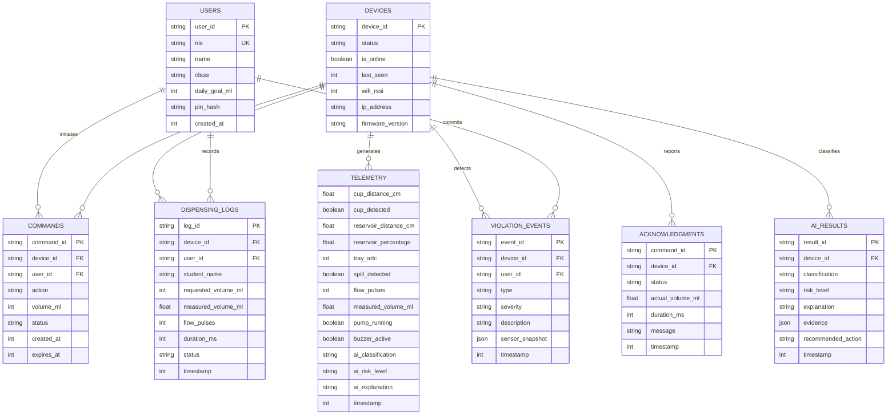

# ENTITY RELATIONSHIP DIAGRAM (ERD) & STRUKTUR BASIS DATA CLOUD
## Smart Dispenser IoT — Firebase Realtime Database

### 1. Diagram ERD Entitas Data

```mermaid
erDiagram
    DEVICES ||--o{ COMMANDS : receives
    DEVICES ||--o{ TELEMETRY : generates
    DEVICES ||--o{ ACKNOWLEDGMENTS : reports
    USERS ||--o{ COMMANDS : initiates
    USERS ||--o{ DISPENSING_LOGS : records
    USERS ||--o{ VIOLATION_EVENTS : commits
    DEVICES ||--o{ DISPENSING_LOGS : executes
    DEVICES ||--o{ VIOLATION_EVENTS : detects
    DEVICES ||--o{ AI_RESULTS : classifies

    DEVICES {
        string device_id PK
        string status
        boolean is_online
        int last_seen
        int wifi_rssi
        string ip_address
        string firmware_version
    }

    USERS {
        string user_id PK
        string nis UK
        string name
        string class
        int daily_goal_ml
        string pin_hash
        int created_at
    }

    TELEMETRY {
        float cup_distance_cm
        boolean cup_detected
        float reservoir_distance_cm
        float reservoir_percentage
        int tray_adc
        boolean spill_detected
        int flow_pulses
        float measured_volume_ml
        boolean pump_running
        boolean buzzer_active
        string ai_classification
        string ai_risk_level
        string ai_explanation
        int timestamp
    }

    COMMANDS {
        string command_id PK
        string device_id FK
        string user_id FK
        string action
        int volume_ml
        string status
        int created_at
        int expires_at
    }

    ACKNOWLEDGMENTS {
        string command_id PK
        string device_id FK
        string status
        float actual_volume_ml
        int duration_ms
        string message
        int timestamp
    }

    DISPENSING_LOGS {
        string log_id PK
        string device_id FK
        string user_id FK
        string student_name
        int requested_volume_ml
        float measured_volume_ml
        int flow_pulses
        int duration_ms
        string status
        int timestamp
    }

    VIOLATION_EVENTS {
        string event_id PK
        string device_id FK
        string user_id FK
        string type
        string severity
        string description
        json sensor_snapshot
        int timestamp
    }

    AI_RESULTS {
        string result_id PK
        string device_id FK
        string classification
        string risk_level
        string explanation
        json evidence
        string recommended_action
        int timestamp
    }
```
